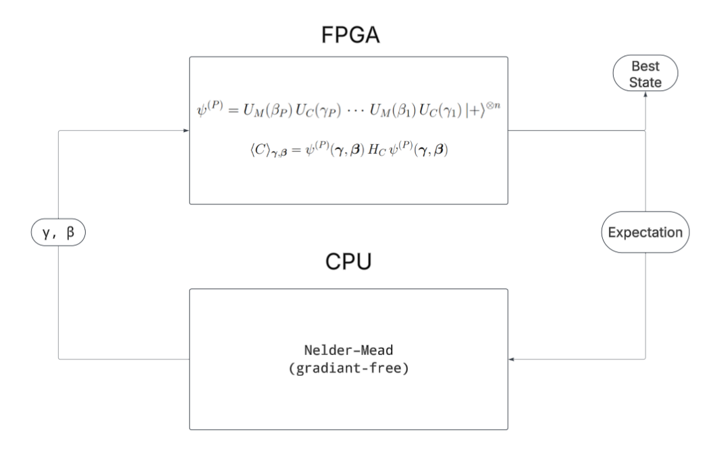
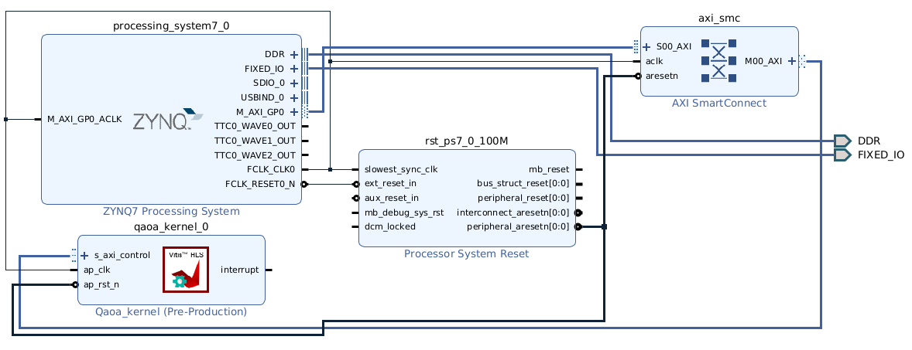

# FPGA-Accelerated QAOA for TSP 

This is an year long research project for Master in Aerospace Engineering students at ISAE-Supaero in Toulouse, France. 

## Research Motivation 
Variational quantum algorithms such as QAOA rely on repeated evaluation of expectation values, a process that becomes computationally expensive as problem size or circuit depth increases. Hardware acceleration offers a practical way to reduce this bottleneck by exploiting parallelism and pipelining at the circuit level. Implementing the QAOA simulation on FPGA provides low-latency, energy-efficient computation while preserving the structure of hybrid quantum–classical workflows. This enables rapid exploration of variational parameter landscapes and helps evaluate how quantum-inspired algorithms might perform in future hardware co-designed quantum systems.

## Travelling Salesman Problem (TSP) 
The Traveling Salesman Problem is a standard NP-hard benchmark with a clear combinatorial structure that maps naturally onto QAOA’s cost Hamiltonian. It is widely used because small instances can be brute-forced for verification, while larger instances highlight the scalability challenges faced by both classical and quantum optimizers. Using TSP provides a meaningful and well-studied test case to evaluate how effectively QAOA, and its hardware-accelerated variants, can approximate solutions to difficult optimisation problems.

## Reference Paper 
Choi S., Lee K., Lee J.-J., Lee W. (2025). *Standalone FPGA-Based QAOA Emulator for Weighted-MaxCut on Embedded Devices*. arXiv:2502.11316. Available at: https://arxiv.org/abs/2502.11316

## FPGA - CPU Architecture 

## Vivado System Architecture 

## To Do
- Test on FPGA (Zybo Legacy)
- Documentation

## Maths 
Look at the report
